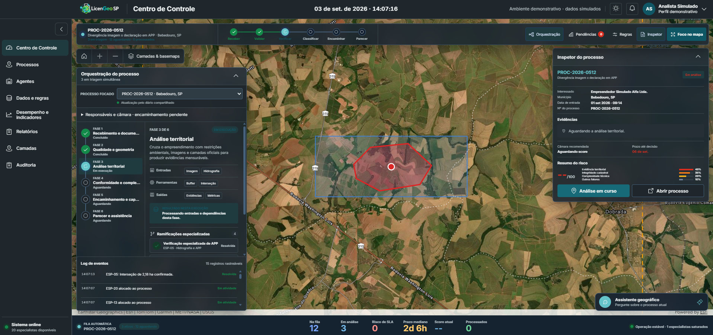
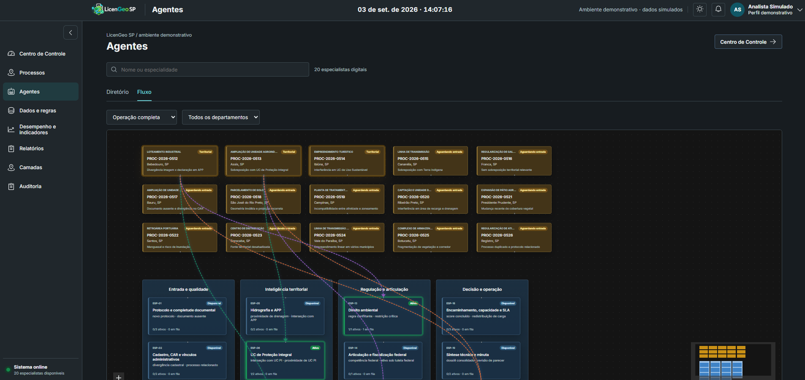

# LicenGeo SP

Demonstracao de triagem ambiental assistida por IA para SEMIL-SP.




## Catalogo da demonstracao

| Campo | Informacao |
| --- | --- |
| Autor | Rodolfo G. Lotte - Arquiteto de Negocios IA |
| Data | Setembro de 2026 |
| Destinatario original | SEMIL-SP, Secretaria de Meio Ambiente, Infraestrutura e Logistica do Estado de Sao Paulo |
| Publico de referencia | Gestores publicos, areas tecnicas ambientais, equipes de licenciamento, operacoes de atendimento e governanca de dados territoriais |
| Industria | Governo, meio ambiente, infraestrutura, licenciamento ambiental, inteligencia territorial e gestao publica digital |
| Tipo | Demonstracao interativa, ambiente simulado, frontend React/Vite |
| Objetivo comercial | Apoiar conversas consultivas sobre IA aplicada a triagem de processos, automacao assistida, priorizacao operacional, rastreabilidade e modernizacao de fluxos publicos ambientais |
| Reaproveitamento | Clientes com alto volume de processos, dependencia de analise geoespacial, regras normativas, filas de especialistas e necessidade de decisao humana auditavel |
| Status | Demonstracao funcional com dados simulados e camadas locais simplificadas |

## Resumo

O LicenGeo SP e uma demonstracao interativa de uma plataforma de apoio a triagem ambiental para processos de licenciamento, desenhada para simular como agentes de IA, especialistas digitais e analistas humanos poderiam trabalhar juntos em um fluxo publico de alta responsabilidade. A aplicacao apresenta um centro de controle com mapa operacional, fila de processos, regras de triagem, evidencias territoriais, indicadores, relatorios, auditoria e catalogo de camadas. O roteiro usa processos ambientais ficticios em municipios paulistas para demonstrar situacoes como divergencia entre declaracao e imagem, intersecoes com APP, unidades de conservacao, terras indigenas, inconsistencias cadastrais, geometria invalida, risco hidrico, mudanca de cobertura vegetal, fontes desatualizadas e necessidade de articulacao municipal ou federal. A proposta nao e substituir a decisao tecnica, mas mostrar um modelo de trabalho em que a IA organiza documentos, valida geometria, cruza camadas, calcula complexidade, encaminha para camaras tecnicas, registra justificativas e entrega dossies rastreaveis para revisao humana. Por ser uma demonstracao, os dados, os resultados, os scores, as datas e parte das geometrias sao sinteticos ou simplificados, servindo como material de conversa para clientes de governo, meio ambiente, infraestrutura, saneamento, energia, logistica, agroindustria e outros setores que lidam com licenciamento, conformidade territorial e grande volume de processos.

## Estrutura regularizada

A estrutura foi mantida sem alterar a aplicacao. A mudanca feita foi apenas normalizar o nome da pasta de configuracao de build para `platform`, que antes estava como `plataform`.

```text
gov-sp-semil-licengeo/
  package.json
  vercel.json
  tsconfig.json
  dist/
    assets/
      layers/
      logo-app/
    index.html
  platform/
    vite.config.mjs
  app/
    index.html
    public/
    src/
```

Papel de cada parte:

- `gov-sp-semil-licengeo/package.json`: scripts, dependencias e metadados do projeto.
- `gov-sp-semil-licengeo/vercel.json`: configuracao de deploy estatico na Vercel.
- `gov-sp-semil-licengeo/dist`: versao gerada para publicacao depois do build.
- `gov-sp-semil-licengeo/platform`: configuracoes da plataforma de execucao e build, hoje contendo o Vite.
- `gov-sp-semil-licengeo/app`: codigo-fonte da demonstracao, com `src` e assets publicos.

## Ultimas atualizacoes

- Inclusao de 15 processos simulados cobrindo diferentes riscos ambientais, administrativos e territoriais.
- Fluxo de agentes atualizado com cinco colunas de processo e distribuicao visual por departamentos.
- Agentes ativos com estado visual destacado, conexoes por departamento e cards de processo com dimensoes estaveis.
- Paineis de indicadores revisados com distribuicao de duracao, acumulado por fase e visao de capacidade.
- Modulos de documentos, fontes territoriais e regras consolidados na area "Dados e regras".
- Relatorios com pre-visualizacao de dossie, evidencias, recomendacao e aviso de ambiente demonstrativo.
- Auditoria funcional com historico de eventos e filtros por processo e tipo de evento.
- Ajustes de responsividade verificados em tela estreita para o fluxo de agentes.

## Como rodar localmente

Requisitos:

- Node.js 22.x
- npm

Passos:

```bash
cd demo
npm ci
npm run dev
```

O servidor local do Vite exibira a URL de acesso no terminal, normalmente `http://localhost:5173`.

Para gerar uma versao de producao:

```bash
cd gov-sp-semil-licengeo
npm run build
```

Para visualizar a versao gerada:

```bash
cd gov-sp-semil-licengeo
npm run preview
```

Para conferir os tipos TypeScript:

```bash
cd gov-sp-semil-licengeo
npm run typecheck
```

## Deploy

A pasta de aplicacao esta em `gov-sp-semil-licengeo`. O projeto ja inclui `gov-sp-semil-licengeo/vercel.json` com a configuracao de deploy para Vercel:

- Framework: Vite
- Instalacao: `npm ci`
- Build: `npm run build`
- Saida: `dist`

Deploy sugerido na Vercel:

1. Criar um novo projeto apontando para a pasta `gov-sp-semil-licengeo`.
2. Garantir Node.js 22.x no ambiente de build.
3. Manter o comando de instalacao como `npm ci`.
4. Manter o comando de build como `npm run build`.
5. Publicar o diretorio `dist`.

Tambem e possivel hospedar a pasta `gov-sp-semil-licengeo/dist` em qualquer servico de arquivos estaticos depois do build.

## Paginas da demonstracao

### Centro de Controle

Tela principal da simulacao. Combina mapa operacional, fila automatica, paineis de trabalho humano, regras ativas, inspetor de processo, bancada de agentes e indicadores de operacao. O usuario pode alternar foco do mapa, abrir assistente territorial, observar processos ativos e acessar o dossie ou a decisao humana.

### Processos

Lista os processos simulados com filtros por municipio, tipo, camara e estado. Permite abrir detalhes de cada processo, consultar documentos, evidencias, recomendacoes, responsaveis e acoes do fluxo demonstrativo.

### Agentes

Mostra a rede de 20 especialistas digitais organizados por departamentos, capacidade e tipos de acionamento. A pagina evidencia como pedidos especializados entram em fila, ficam ativos, sao resolvidos e contribuem para a triagem.

### Dados e regras

Agrupa tres visoes: documentos, fontes territoriais e regras. Em documentos, a demonstracao mostra completude, legibilidade, vigencia e consistencia. Em fontes territoriais, lista camadas locais simplificadas. Em regras, permite criar rascunhos, comparar efeitos simulados e publicar uma versao demonstrativa.

### Desempenho e indicadores

Apresenta metricas do portifolio simulado, incluindo distribuicao de tempos, fases, capacidade dos especialistas e evolucao das solicitacoes. Serve para discutir gestao de fila, gargalos, priorizacao e impacto operacional da IA.

### Relatorios

Gera pre-visualizacao de dossies e materiais de apoio com evidencias, recomendacoes, origem dos dados e aviso de demonstracao. A pagina apoia conversas sobre transparencia, prestacao de contas e revisao tecnica.

### Camadas

Exibe o catalogo territorial usado na simulacao, com recortes simplificados de unidades de conservacao, terras indigenas e APPs simuladas. A pagina deixa claro que as camadas sao locais, simplificadas e nao certificadas para decisao real.

### Auditoria

Registra eventos do fluxo, como recebimento, conclusao de fases, acionamento de especialistas, evidencias, recomendacoes, decisoes humanas e emissao de dossie. Ajuda a demonstrar rastreabilidade, governanca e explicabilidade operacional.

## Cenarios abordados

- Divergencia entre area declarada e imagem recente.
- Sobreposicao com APP hidrica.
- Intersecao com Unidade de Conservacao de Protecao Integral.
- Interferencia em Unidade de Conservacao de Uso Sustentavel.
- Sobreposicao com Terra Indigena.
- Processo sem restricao territorial relevante.
- Documento ausente e divergencia cadastral no CAR.
- Geometria invalida e sistema de referencia incorreto.
- Incompatibilidade entre atividade declarada e zoneamento.
- Interferencia em area de recarga, drenagem ou sensibilidade hidrica.
- Mudanca recente de cobertura vegetal.
- Manguezal, inundacao e multiplas sensibilidades costeiras.
- Fonte territorial desatualizada.
- Empreendimento linear em varios municipios.
- Fragmentacao de vegetacao e corredor ecologico.
- Processo duplicado e protocolo relacionado.

## Dados e limites

Esta demonstracao usa dados sinteticos, resultados simulados e camadas locais simplificadas. Ela nao deve ser usada para decisao ambiental real, certificacao institucional, analise juridica, validacao geoespacial oficial ou conclusao tecnica sobre processos existentes. Seu papel e servir como material de demonstracao e conversa sobre desenho de produto, arquitetura de IA, triagem assistida, governanca de dados e operacao publica com decisao humana.
